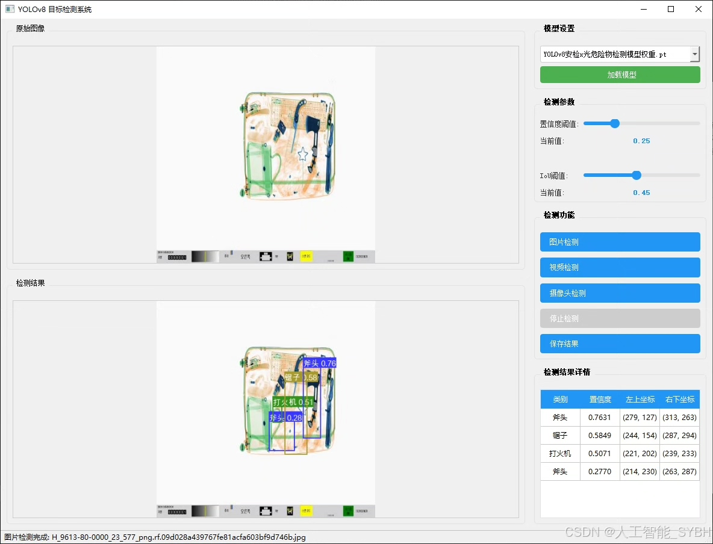
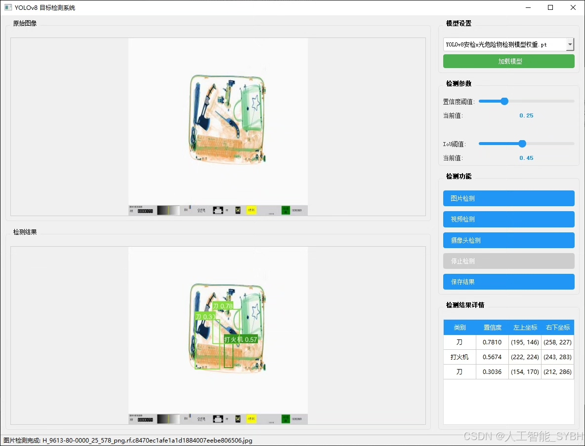
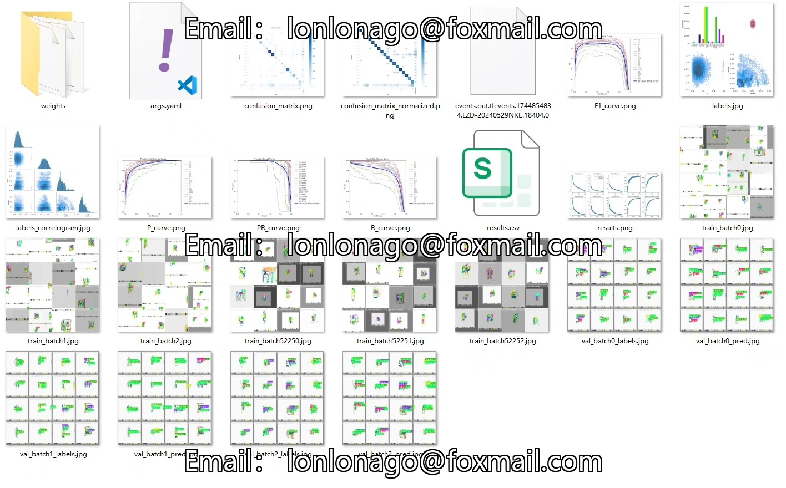
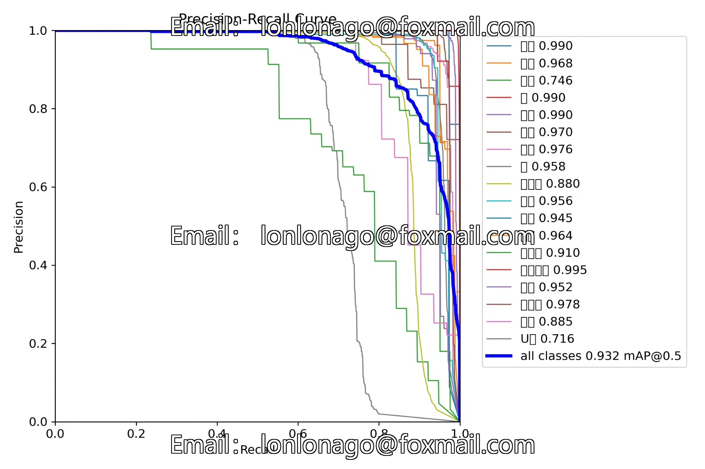
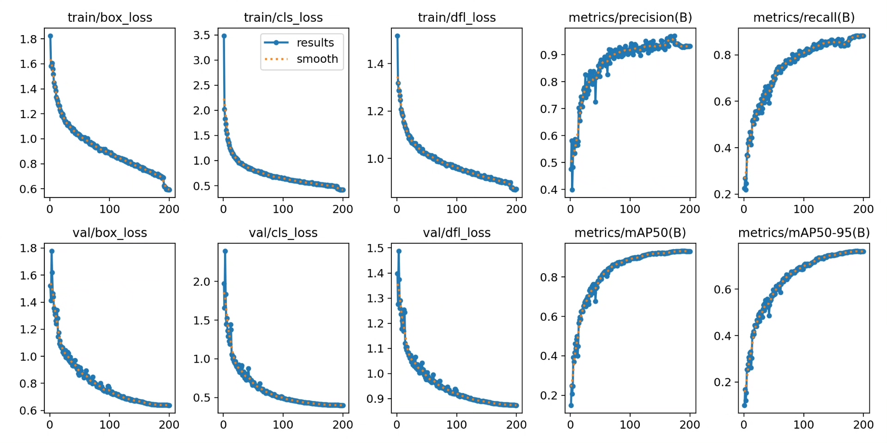
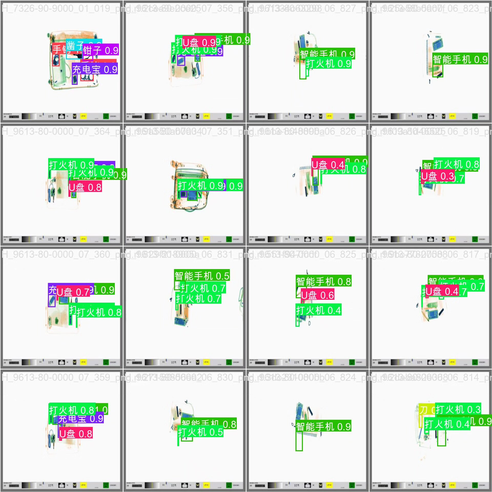
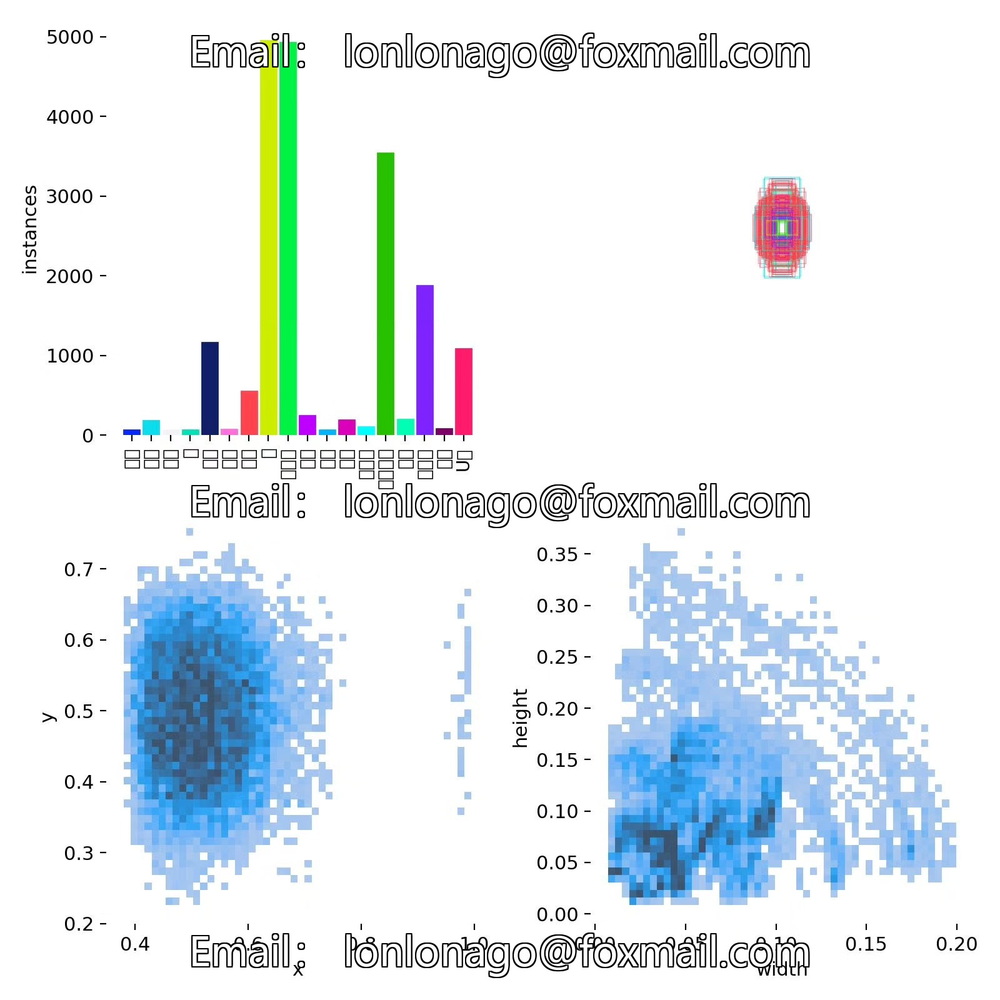
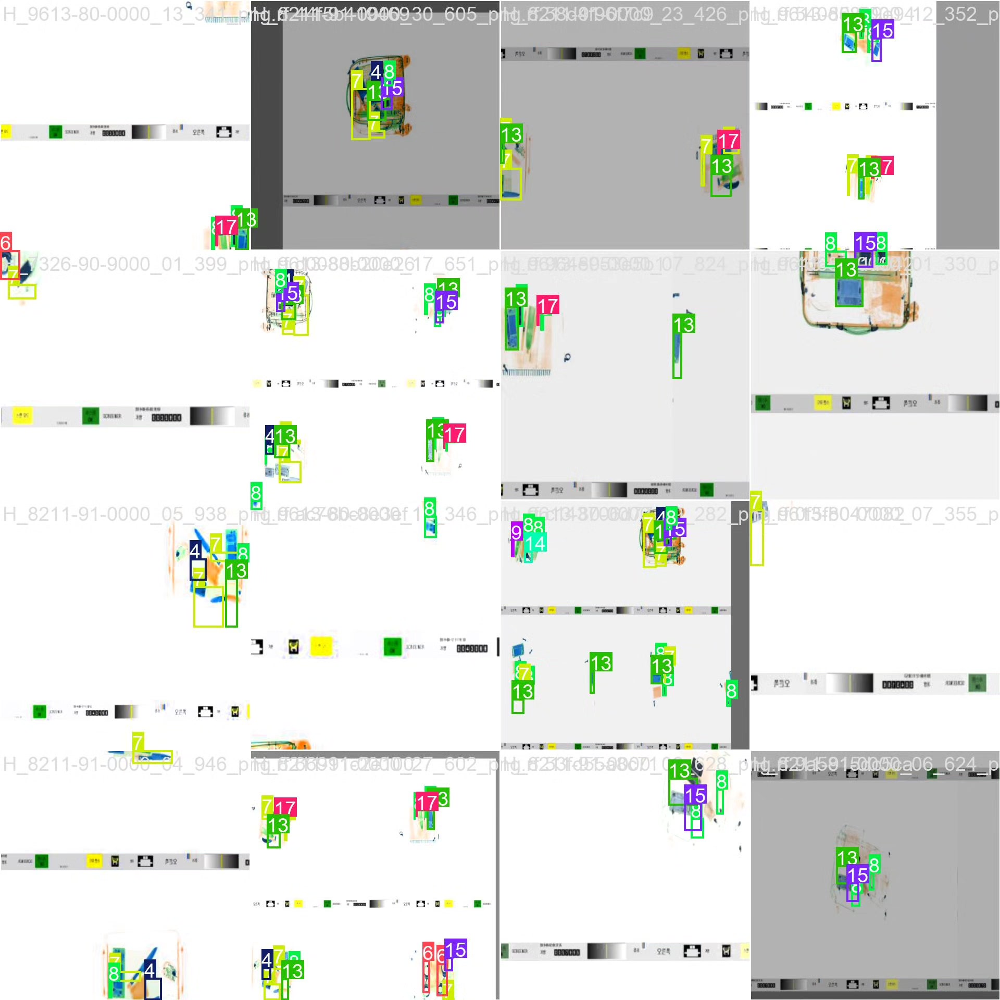

# Based on YOLOv8 deep learning for the inspection and X-ray hazardous material detection system (YOLOv

## Body

Based on the advanced YOLOv8 object detection algorithm, this project has developed a set of automatic detection systems for dangerous items in X-ray images used for security inspections. The system can identify 18 common dangerous items, including various types of knives (Axe, Knife, Throwing Knife, etc.), tool-related items (Hammer, Chisel, Spade, etc.), flammable and explosive items (Firecracker, Lighter), electronic devices (SmartPhone, USB, SupplementalBattery), and weapon-related items (Gun, Handcuffs) among others. The project uses a dataset containing 6265 labeled X-ray images for training and validation, with 4385 training images and 1880 validation images, covering various angles, occlusion situations, and scene combinations for security inspections.

The company's products have obtained the official commercial license certification from YOLO.

We provide after-sales service.

After payment, we will provide WeChat ID to answer questions anytime.

Environment configuration: We will provide an environment configuration tutorial, and WeChat will provide answers to questions.

Remote installation service: If you need remote configuration, an additional fee of 69 is required,
failure in configuration will result in all fees refunded (only installation fee refunded for special old computers).

Retraining dataset: After setting up the environment, you can train on your own computer.
If you need us to retrain, just pay 69+ computing power fee (2.5 yuan/hour).

Full after-sales service

## Images

## Payment

Here is a pay link on Stripe ( https://buy.stripe.com/3cs8yP7sY87d0vu9AB ). Please contact me lonlonago@foxmail.com after funding $89, and I will send you a complete data files , thank you!

